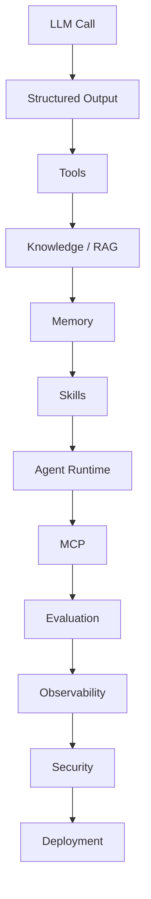

# Agentic Developer Handbook

A Java-first, open-source handbook and runnable reference implementation for understanding and building agentic systems. It is not another agent framework, and it is not a skill marketplace.

Start with a simple LLM call. Add one capability at a time. Learn what each piece solves, how it works, and when you actually need it.

**You probably don't need all of these.**

The diagram below is a learning path. It is not a mandatory architecture. Stop when the problem is solved.



Multi-agent systems, A2A, and fine-tuning come later, and many applications never need them.

Every chapter will say both when to use a concept and when not to. A single LLM call that answers a question is not an agent. A database lookup does not become RAG because the application also calls a model. A local Java method does not need MCP.

## Why this project exists

Agent, tool calling, RAG, memory, skills, MCP, A2A, fine-tuning, and multi-agent systems are often used as if they were the same idea. They are not.

This handbook builds a mental model of what each concept means, how it differs from the others, and where it sits in an ordinary software architecture. The explanation is paired with runnable Java code, added one concept at a time.

The canonical implementation is Java. The conceptual chapters stay readable without Java.

## What you will learn

- How to tell a model call from an agent
- What tools, knowledge, memory, and skills each contribute
- When RAG, a vector database, MCP, or another agent is unnecessary
- How to implement the concepts that you do need in Java
- What changes when a small example has to survive production: evaluation, observability, security, and deployment

The first two labs, [labs/01-model-call](labs/01-model-call/README.md) and [labs/02-structured-output](labs/02-structured-output/README.md), are implemented and runnable. The rest of the list is the plan, not a catalog of finished features.

## Learning path

| Step | Question it answers |
| --- | --- |
| LLM call | How do I call a model, and why is that not an agent? |
| Structured output | How do I get a response my code can trust? |
| Tools | How does the application do something the model cannot do? |
| Knowledge / RAG | What information has to be fetched into the prompt? |
| Memory | What should persist across turns? |
| Skills | How should the agent perform a particular task? |
| Agent runtime | What owns the loop, the limits, and the decision to stop? |
| MCP | How does the agent reach external capabilities through a standard protocol? |
| Evaluation | How do I know the system does what I intended? |
| Observability | How do I see what it did in production? |
| Security | What has to be checked at each boundary? |
| Deployment | What does it take to run it as a production system? |

The same path is described in [VISION.md](VISION.md) and tracked in [ROADMAP.md](ROADMAP.md).

## Mental model

An agent is an application. A model, a tool, a skill, a retrieval step, and a protocol are parts the application may use. They are not agents by themselves.

```
                    ┌──────── Model
                    │
                    ├──────── Tools
                    │
User → Agent Runtime ├──────── Knowledge
                    │
                    ├──────── Memory
                    │
                    └──────── Skills
```

The full model, including MCP, A2A, evaluation, observability, and security, is in [docs/mental-model.md](docs/mental-model.md). Short definitions are in [docs/glossary.md](docs/glossary.md).

## Repository structure

```
agentic-developer-handbook/
├── README.md
├── VISION.md
├── ROADMAP.md
├── CONTRIBUTING.md
├── CODE_OF_CONDUCT.md
├── SECURITY.md
├── LICENSE
├── NOTICE
├── pom.xml
├── mvnw
├── mvnw.cmd
├── docs/
│   ├── mental-model.md
│   ├── glossary.md
│   ├── architecture.md
│   └── adr/
├── labs/
│   ├── README.md
│   ├── 01-model-call/
│   └── 02-structured-output/
└── .github/
```

[docs/architecture.md](docs/architecture.md) records the engineering principles. [docs/adr/](docs/adr/README.md) records the decisions already made. [labs/README.md](labs/README.md) describes how labs are written and lists them; the first, [01-model-call](labs/01-model-call/README.md), is runnable.

## Current status

This repository is at the beginning.

Milestone 0, the foundation, is done: the handbook documents, the contribution model, the architecture decisions, and a Maven build that runs without API keys. Milestone 1 is done: [labs/01-model-call](labs/01-model-call/README.md) makes a real Gemini call and explains why that call is not an agent. Milestone 2 is done: [labs/02-structured-output](labs/02-structured-output/README.md) constrains the response with a schema and turns it into a typed Java record — still not an agent. Later milestones are not started.

Nothing here stores embeddings or runs an agent.

## Contributing

Issues and pull requests are welcome. Read [CONTRIBUTING.md](CONTRIBUTING.md) before you start. The expected community standard is in [CODE_OF_CONDUCT.md](CODE_OF_CONDUCT.md).

```sh
./mvnw verify
```

On Windows, use `mvnw.cmd verify`. This builds every module and runs the tests without calling Gemini, so it needs no API key. Running a lab against the real Gemini API does need one; each lab README shows its commands, starting with [labs/01-model-call](labs/01-model-call/README.md).

## License

This project is licensed under the [Apache License 2.0](LICENSE).

Copyright 2026 Çağrı Dursun. See [NOTICE](NOTICE).
