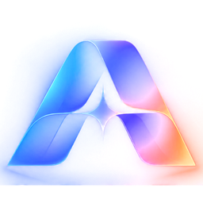

<p align="center">
  
</p>

<h1 align="center">Agentic Developer Handbook</h1>

<p align="center">

[](https://github.com/cagridursun/agentic-developer-handbook/actions/workflows/build.yml)
[](LICENSE)
[](docs/adr/0005-upgrade-canonical-java-to-27.md)

</p>

A Java-first, open-source handbook for understanding and building agentic systems, one concept at a time. Each concept comes with a small runnable Java lab — and an honest answer to "when should I *not* use this?"

It is not an agent framework, a library catalog, or a skill marketplace.

**You probably don't need all of these.**


```mermaid
flowchart LR
    model["Model"] --> structured["Structured Output"] --> tools["Tools"] --> knowledge["Knowledge / RAG"] --> memory["Memory"] --> skills["Skills"] --> runtime["Agent Runtime"] --> mcp["MCP"] --> evaluation["Evaluation"] --> observability["Observability"] --> security["Security"] --> deployment["Deployment"]
```

This is a learning path, not a mandatory architecture. Stop when the problem is solved. A single LLM call is not an agent. A database lookup does not become RAG because the application also calls a model. A local Java method does not need MCP.

> **Available today:** twelve runnable labs — from a single model call to a bounded agent runtime that reaches one capability through MCP, then a small evaluation of that agent's behavior, then a trace of one run so a failure can be diagnosed, and then application-owned security controls around what that agent's proposals may cause, and then the same application packaged and run as a deployable artifact without weakening any of those controls — a composition capstone, and an architecture readiness assessment.
>
> **Start with** [Lab 01 — Your first model call](labs/01-model-call/README.md). `./mvnw verify` builds and tests everything without an API key.
>
> **Not implemented:** a production platform. Lab 12 is a teaching deployment; what it leaves out is listed in its README and on the [roadmap](ROADMAP.md).

## Why this project exists

Agent, tool calling, RAG, memory, skills, MCP, A2A, fine-tuning, and multi-agent systems are often used as if they were the same idea. They are not.

This handbook builds a mental model of what each concept means, how it differs from the others, and where it sits in an ordinary software architecture. The explanation is paired with runnable Java code, added one concept at a time, and every lab says both when to use its concept and when not to.

The canonical implementation is Java 27, the current feature release; the handbook intentionally follows the current Java platform. The conceptual chapters stay readable without Java.

## Start here

**New to agentic systems?**

1. Start with [Lab 01](labs/01-model-call/README.md): one model call, and why it is not an agent.
2. Follow the labs in order through [Lab 07](labs/07-agent-runtime/README.md), the first bounded agent runtime, [Lab 08](labs/08-mcp/README.md), where one of its capabilities moves outside the process behind MCP, [Lab 09](labs/09-evaluation/README.md), where you learn to check that agent's behavior across cases instead of trusting a demo, [Lab 10](labs/10-observability/README.md), where you reconstruct what one failed run actually did, [Lab 11](labs/11-security/README.md), where you decide what a model's proposal is allowed to cause, and [Lab 12](labs/12-deployment/README.md), where you package and run that application without losing any of those decisions. Each lab adds one concept to the last.
3. After Lab 07, try [Capstone 01](capstones/01-agentic-system/README.md): compose what you learned around one realistic problem.
4. Already have a use case? Use the [readiness assessment](assessments/agentic-system-readiness/README.md) to decide whether it needs an LLM, RAG, tools, memory, or an agent at all.

**Experienced developer?** Jump to the [mental model](docs/mental-model.md) or to any lab — each lab README stands on its own.

You need Java 27. The build and every test run without an API key or network model calls; running a lab against the real Gemini API needs a key, and each lab README shows the exact commands.

```sh
git clone https://github.com/cagridursun/agentic-developer-handbook.git
cd agentic-developer-handbook
./mvnw verify            # Windows: mvnw.cmd verify
```

## Learning path

| # | Step | Question it answers | Status |
| --- | --- | --- | --- |
| 1 | Model | How do I call a model, and why is that not an agent? | [Lab 01](labs/01-model-call/README.md) |
| 2 | Structured output | How do I get a response my code can trust? | [Lab 02](labs/02-structured-output/README.md) |
| 3 | Tools | How does the application do something the model cannot do? | [Lab 03](labs/03-tool-calling/README.md) |
| 4 | Knowledge / RAG | What information has to be fetched into the prompt? | [Lab 04](labs/04-rag/README.md) |
| 5 | Memory | What should persist across turns? | [Lab 05](labs/05-memory/README.md) |
| 6 | Skills | How should the agent perform a particular task? | [Lab 06](labs/06-skills/README.md) |
| 7 | Agent runtime | What owns the loop, the limits, and the decision to stop? | [Lab 07](labs/07-agent-runtime/README.md) — the first lab this handbook calls an agent |
| 8 | MCP | What changes when a capability lives outside the application? | [Lab 08](labs/08-mcp/README.md) |
| 9 | Evaluation | How do I know the system does what I intended? | [Lab 09](labs/09-evaluation/README.md) |
| 10 | Observability | What actually happened during this run? | [Lab 10](labs/10-observability/README.md) |
| 11 | Security | What has to be checked at each boundary? | [Lab 11](labs/11-security/README.md) |
| 12 | Deployment | How do I run the same application, with the same controls, outside my IDE? | [Lab 12](labs/12-deployment/README.md) |

Multi-agent systems, A2A, and fine-tuning come later, and many applications never need them. The numbered milestones are tracked in [ROADMAP.md](ROADMAP.md); the reasoning behind the path is in [VISION.md](VISION.md).

## Beyond the labs

The handbook has three kinds of learning artifact:

| Artifact | Job |
| --- | --- |
| [Labs](labs/README.md) | Teach one concept. |
| [Capstones](capstones/README.md) | Compose concepts already taught. |
| [Assessments](assessments/README.md) | Help decide whether those concepts are needed at all. |

- **[Capstone 01 — Build a Small Agentic System](capstones/01-agentic-system/README.md).** After Lab 07: decide which capabilities a fictional incident investigation needs, build it, and compare with one reference design that deliberately leaves capabilities out.
- **[Agentic System Readiness Assessment](assessments/agentic-system-readiness/README.md).** For your own use case: a fixed order of questions, starting with "could ordinary software do this?" It can conclude that you need no LLM at all, or an LLM but no agent.
- **[Interactive site](https://cagridursun.github.io/agentic-developer-handbook/).** Browser-only versions of the assessment and Capstone 01, with no backend and no accounts. Start with the labs here for the canonical learning path; use the site for the interactive assessment and capstone. See [site/README.md](site/README.md).

## Mental model

An agent is an application. A model, a tool, a skill, a retrieval step, and a protocol are parts the application may use. They are not agents by themselves.

```
                    ┌──────── Model
                    │
                    ├──────── Tools
                    │
User → Agent Runtime ├──────── Knowledge
                    │
                    ├──────── Memory
                    │
                    └──────── Skills
```

Key documents:

- [Mental model](docs/mental-model.md) — how the pieces relate, including MCP, A2A, evaluation, observability, and security
- [Glossary](docs/glossary.md) — short working definitions, and the pairs most often confused
- [LLM vs Decision Authority](docs/model-vs-decision-authority.md) — the model may propose; the application decides what becomes executable
- [Architecture](docs/architecture.md) and [ADRs](docs/adr/README.md) — the engineering principles and the decisions already made

## Repository structure

```
agentic-developer-handbook/
├── README.md
├── VISION.md
├── ROADMAP.md
├── CONTRIBUTING.md
├── CODE_OF_CONDUCT.md
├── SECURITY.md
├── LICENSE
├── NOTICE
├── pom.xml
├── mvnw
├── mvnw.cmd
├── docs/
│   ├── mental-model.md
│   ├── glossary.md
│   ├── architecture.md
│   ├── model-vs-decision-authority.md
│   └── adr/
├── labs/
│   ├── README.md
│   ├── 01-model-call/
│   ├── 02-structured-output/
│   ├── 03-tool-calling/
│   ├── 04-rag/
│   ├── 05-memory/
│   ├── 06-skills/
│   ├── 07-agent-runtime/
│   ├── 08-mcp/
│   ├── 09-evaluation/
│   ├── 10-observability/
│   ├── 11-security/
│   └── 12-deployment/
├── capstones/
│   ├── README.md
│   └── 01-agentic-system/
├── assessments/
│   ├── README.md
│   └── agentic-system-readiness/
├── site/                  # interactive learning site (static, published to GitHub Pages)
├── scripts/               # roadmap sync and stdlib Python checks
└── .github/
```

[labs/README.md](labs/README.md) describes how labs are written and lists the twelve runnable labs.

## Current status

Labs 01–12 run end to end: from a single model call to a bounded, read-only agent runtime (Lab 07), the same runtime reaching one capability that lives in another process through MCP (Lab 08), and then an evaluation set and a small harness that check that agent's behavior — the final answer and the trajectory — and catch a deliberate regression (Lab 09), and then a trace, a few structured log lines, and a handful of metrics that let you reconstruct why one run failed (Lab 10), and then application-owned controls — argument validation, authorization, bound approvals, and redaction — that decide what a model's proposal is allowed to cause, with direct and indirect prompt injection as the test (Lab 11), and then that same application packaged as one jar, configured from the environment, started with liveness and readiness endpoints, shut down gracefully, and built into a minimal non-root container image, with tests that prove deployment did not bypass those controls (Lab 12). Capstone 01 and the readiness assessment build on them. The numbered path ends here. Lab 12 is a teaching deployment, not a production platform: Kubernetes, cloud infrastructure, secret managers, identity, autoscaling, and full telemetry platforms are not implemented, and its README says what the gap to production is.

Nothing here stores embeddings, and the only agent is the bounded runtime introduced in Lab 07; Labs 08, 09, 10, 11, and 12 reuse it rather than adding another. This is a learning path, not a production platform. Progress is tracked in [ROADMAP.md](ROADMAP.md) and mirrored to [GitHub milestones](https://github.com/cagridursun/agentic-developer-handbook/milestones).

## Contributing

Found a confusing explanation, a better example, or an architectural edge case? [Open an issue](https://github.com/cagridursun/agentic-developer-handbook/issues/new/choose) — there are templates for corrections, learning feedback, and proposals.

Useful contributions include:

- corrections to concepts, code, or wording
- documentation and diagram improvements
- deterministic tests that need no API key
- API compatibility updates when a provider SDK changes
- implementation improvements to completed labs
- feedback on the learning experience: where a lab, the capstone, or the assessment was confusing
- curated community examples for concepts already taught — proposed first as an issue

The numbered labs are maintainer-curated: improving them is welcome, but redefining or reordering the canonical path is not. An example has to teach an architectural decision, not only library syntax. [CONTRIBUTING.md](CONTRIBUTING.md) has the details and how to verify a change locally:

```sh
./mvnw verify                                   # every module and test, no API key
python -m unittest discover -s scripts/tests    # stdlib checks: roadmap, site, assessment, links
```

The expected community standard is in [CODE_OF_CONDUCT.md](CODE_OF_CONDUCT.md). Security issues go through [SECURITY.md](SECURITY.md), not public issues.

## License

This project is licensed under the [Apache License 2.0](LICENSE).

Copyright 2026 Çağrı Dursun. See [NOTICE](NOTICE).
