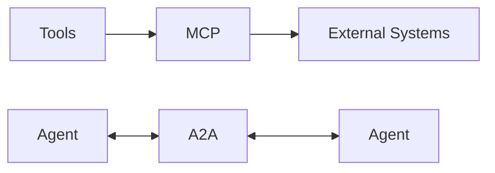

# Mental model

An agentic system is an ordinary application that uses a model. The application decides which other pieces to add. The pieces are not the agent.

**You probably don't need all of these.**

## The runtime

```
                    ┌──────── Model
                    │
                    ├──────── Tools
                    │
User → Agent Runtime ├──────── Knowledge
                    │
                    ├──────── Memory
                    │
                    └──────── Skills
```

The user talks to the application. The agent runtime owns the loop: call the model, maybe do some work, call the model again, and stop. The model is one dependency of that runtime.

| Piece | Role | Concrete example |
| --- | --- | --- |
| Model | Produces the next text or structured response | Writes a reply about an order |
| Tools | Actions the application can perform | `getOrder(id)` implemented in Java |
| Knowledge | Information fetched into the prompt | A help-center article about refunds |
| Memory | State kept across turns | This customer's earlier messages |
| Skills | Instructions for how to perform a task | The procedure for handling a refund |

A support bot that calls a model once and prints the text has a model. It does not yet have an agent runtime. At that point we have an LLM call, not an agent.

## Protocols

Tools can live in the same process as the runtime. When they live somewhere else, a protocol gives the runtime a standard way to reach them.



MCP connects an agent to external tools and data. A2A connects independent agents to each other. Calling a method in the same Java process does not require either protocol.

## Around the runtime

Evaluation and observability surround the runtime. They are not steps inside the prompt.

- Evaluation asks whether the system did what we intended, before and after a change.
- Observability shows what a running system did: which model was called, which tool ran, how long it took, and where it failed.

Security applies at every boundary, not as a final layer painted on at deployment:

- what the user sends in
- what the model sends back
- arguments passed to a tool
- documents retrieved into the prompt
- skill text loaded from a file
- messages from MCP servers and from other agents

The model is not the authorization layer. A prompt that says "only answer if the user is allowed" does not enforce access control. The application does.

## What is not an agent

| Thing | What it actually is |
| --- | --- |
| Model | A component that performs inference |
| Tool | Code the application can run |
| MCP | A protocol for reaching external capabilities |
| Skill | Instructions for how to perform a task |
| RAG | A retrieval step that fills the prompt |
| Fine-tuning | A training process that changes model weights |

An agent is an application runtime that combines some of these around a model and an execution loop. One of them, used alone, is not an agent.

## You probably don't need all of these

Add a piece when it solves a problem the current design cannot solve.

- Do not build an agent if one LLM call solves the problem.
- Do not use RAG if a normal database query, API call, or file lookup solves the problem.
- Do not add a vector database because the application uses a model. Add one when similarity search is the retrieval problem you have.
- Do not introduce multiple agents when one agent with tools is enough.
- Do not use fine-tuning to store information that changes often. Put that information in knowledge or memory and retrieve it.
- Do not introduce MCP just to call a local Java function.
- Do not call something an agent when it is a single LLM request.

Definitions of the terms used here are in [glossary.md](glossary.md). How the repository will implement the path is in [architecture.md](architecture.md).
