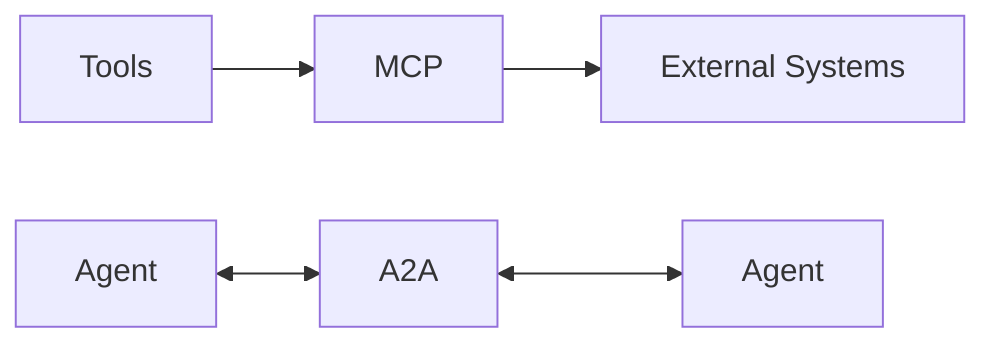

# Mental model

An agentic system is an ordinary application that uses a model. The application decides which other pieces to add. The pieces are not the agent.

**You probably don't need all of these.**

## The runtime

```
                    ┌──────── Model
                    │
                    ├──────── Tools
                    │
User → Agent Runtime ├──────── Knowledge
                    │
                    ├──────── Memory
                    │
                    └──────── Skills
```

The user talks to the application. The agent runtime owns the loop: call the model, maybe do some work, call the model again, and stop. The model is one dependency of that runtime.

| Piece | Role | Concrete example |
| --- | --- | --- |
| Model | Produces the next text or structured response | Writes a reply about an order |
| Tools | Actions the application can perform | `getOrder(id)` implemented in Java |
| Knowledge | Information fetched into the prompt | A help-center article about refunds |
| Memory | State kept across turns | This customer's earlier messages |
| Skills | Instructions for how to perform a task | The procedure for handling a refund |

A support bot that calls a model once and prints the text has a model. It does not yet have an agent runtime. At that point we have an LLM call, not an agent.

## Protocols

Tools can live in the same process as the runtime. When they live somewhere else, a protocol gives the runtime a standard way to reach them.


```mermaid
flowchart LR
    tools["Tools"] --> mcp["MCP"]
    mcp --> external["External Systems"]
    agentA["Agent"] <--> a2a["A2A"]
    a2a <--> agentB["Agent"]
```

MCP connects an agent to external tools and data. A2A connects independent agents to each other. Calling a method in the same Java process does not require either protocol.

MCP sits below the runtime's tool boundary, not above the runtime. The model does not speak MCP; it proposes a tool, and the application decides where that tool runs:

```
Model
  ↓ proposes ToolRequest
Agent Runtime
  ↓ validates
Application Tool Boundary
  ├── Local Java Tool
  └── MCP Client
          ↓
       MCP Server
          ↓
    External Capability
```

MCP does not create the agent, and it does not decide what the agent may do. A server announcing a tool in `tools/list` is information; the application's allowlist is the permission. [Lab 08](../labs/08-mcp/README.md) takes the Lab 07 agent and moves one of its two tools behind an MCP server in a separate process — same agent, same loop, one capability now remote.

## Around the runtime

Evaluation and observability surround the runtime. They are not steps inside the prompt.

- Evaluation asks whether the system behaves as intended across representative cases, before and after a change — in its final answer and in the trajectory that produced it. A test checks that a component obeys its contract; an evaluation checks behavior, and a model-backed system can pass every test while its behavior gets worse. [Lab 09](../labs/09-evaluation/README.md) builds the smallest version of this around the Lab 07 agent.
- Observability shows what a running system did: which model was called, which tool ran, how long it took, and where it failed. Evaluation gives controlled evidence about quality; observability gives runtime evidence about what actually happened. [Lab 10](../labs/10-observability/README.md) records one run of the Lab 07 agent as a trace.

Observability wraps the whole run. It records every step and changes none of them:

```
┌──────────────────────────────────────────────────────────────────────┐
│ OBSERVABILITY: logs / metrics / traces                               │
└──────────────────────────────────────────────────────────────────────┘
                                  ▲
                                  │  the run emits events; a person reads them
                                  ▼
User → Agent Runtime → Model → Decision → Tool / MCP → Observation
                         ▲                                  │
                         └─────── next Model decision ◄─────┘
                                  │
                                  ▼
                           Final response
```

The two-way arrow is about information, not control. The run emits events into observability, and a person reads them afterwards to understand the run. Nothing flows back into the run's decisions: observability observes, it does not decide. The same events mean different things in the three signals:

- A **log** is one timestamped event: `event=tool_call tool=getServiceStatus status=OK`.
- A **metric** is a number aggregated across runs: `agent.tool.calls = 8`.
- A **trace** is the structured record of one run: a tree of spans that share one correlation id, so a model decision, the tool call it proposed, and the tool result belong together.

Logs tell you individual events, metrics tell you aggregate behavior, and traces tell you how events belong to one run. An agent benefits from traces because one request becomes a chain of decisions, tool calls, and observations.

Security applies at every boundary, not as a final layer painted on at deployment:

- what the user sends in
- what the model sends back
- arguments passed to a tool
- documents retrieved into the prompt
- skill text loaded from a file
- messages from MCP servers and from other agents

The model is not the authorization layer. A prompt that says "only answer if the user is allowed" does not enforce access control. The application does.

## Influence is not authority

Inside the runtime, the model influences the next step: it reasons, proposes, and recommends. The runtime owns the allowed actions, the validation of every argument, the authorization boundary, the budget, the execution, and the stopping. A model proposal may even be executed automatically — after deterministic checks the application wrote in advance — and the authority still never moved to the model.

The distinction has its own page: [LLM vs Decision Authority](model-vs-decision-authority.md).

## What is not an agent

| Thing | What it actually is |
| --- | --- |
| Model | A component that performs inference |
| Tool | Code the application can run |
| MCP | A protocol for reaching external capabilities |
| Skill | Instructions for how to perform a task |
| RAG | A retrieval step that fills the prompt |
| Fine-tuning | A training process that changes model weights |

An agent is an application runtime that combines some of these around a model and an execution loop. One of them, used alone, is not an agent.

## You probably don't need all of these

Add a piece when it solves a problem the current design cannot solve.

- Do not build an agent if one LLM call solves the problem.
- Do not use RAG if a normal database query, API call, or file lookup solves the problem.
- Do not add a vector database because the application uses a model. Add one when similarity search is the retrieval problem you have.
- Do not introduce multiple agents when one agent with tools is enough.
- Do not use fine-tuning to store information that changes often. Put that information in knowledge or memory and retrieve it.
- Do not introduce MCP just to call a local Java function. For one remote service used by one application, an ordinary API client is often simpler.
- Do not call something an agent when it is a single LLM request.

Definitions of the terms used here are in [glossary.md](glossary.md). How the repository will implement the path is in [architecture.md](architecture.md).
